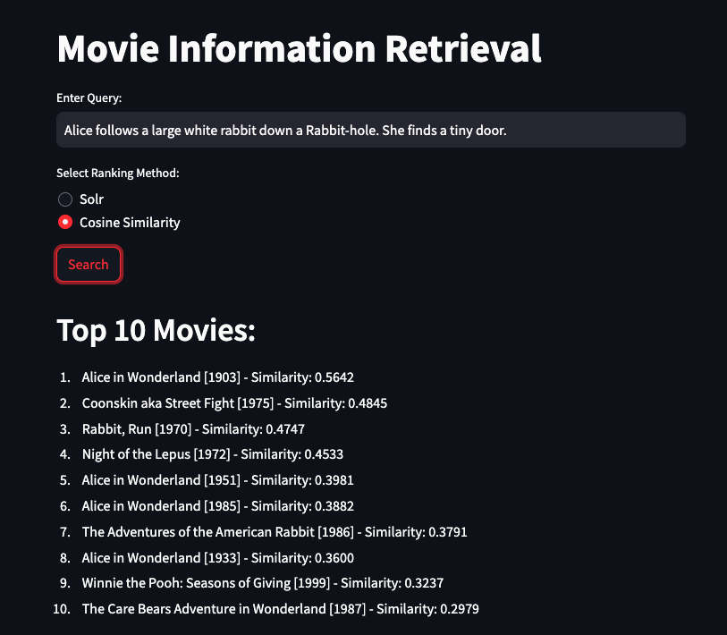
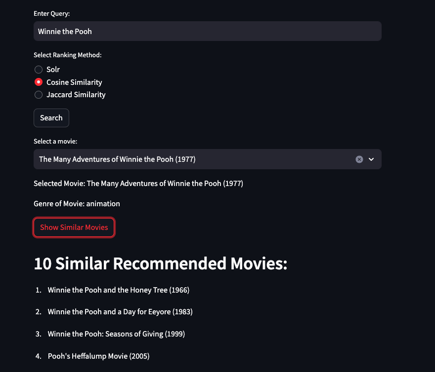

# Movies Retrieval System

## Introduction

The retrieval system we've built can be used to search for movies. Our movie retrieval system offers two search options. The first allows users to search for movies by entering a description or keywords. The second approach recommends similar movies based on the genre of a specified movie title.

## Datasets :
For this project we used the dataset found on kaggle :
- https://www.kaggle.com/datasets/jrobischon/wikipedia-movie-plots/

## Features

We have implemented two features that are given below:

- Searching and retrieving movies based on movie descriptions or keywords relating to the movie.
- Searching and retrieving similar movies to a given movie. Here, we use the genre of a movie as a possible baseline label for evaluation.

## Code:

The code is divided into two parts, each represented by a separate notebook. In these notebooks, we explore the data and apply various techniques and algorithms.

- [First Feature](https://github.com/AnnilaMunsaf/InformationRetrievalProject/blob/master/Movies_retrieval_system.ipynb)
- [Second Feature](https://github.com/AnnilaMunsaf/InformationRetrievalProject/blob/master/Movies_retrieval_system.ipynb)

Then we integrated our main code in Steamlit framework. We have two web-based applications in two folders. 

- movies_retrieval_system
- movies_retrieval_system_genre

There are two python files from where can launch our app namely:

- app.py
- app_genre.py

  
  

## Libraries :

- pandas~=2.0.3
- numpy
- spacy~=3.7.2
- scikit-learn~=1.3.2
- matplotlib~=3.7.4
- plotly
- scipy
- wordcloud
- gensim~=4.3.2
- nltk~=3.8.1
- python-levenshtein
- streamlit~=1.29.0
- pyspellchecker